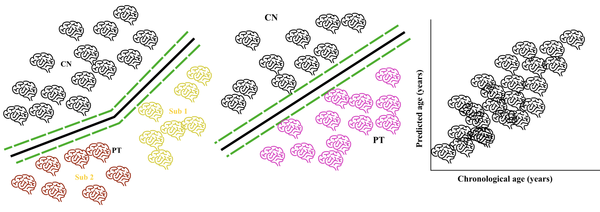
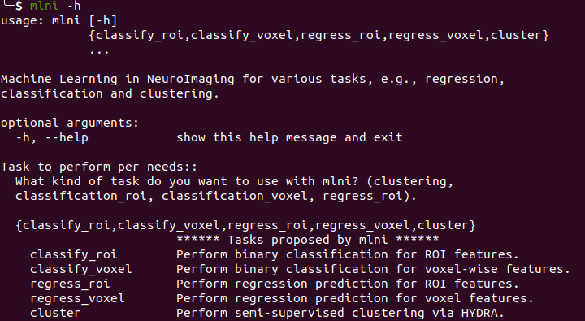

<p align="center">
  
</p>

# MLNI documentation
**Machine Learning in NeuroImaging (MLNI)** is a python package that performs various tasks using neuroimaging data: i) binary classification for disease diagnosis, following good practice proposed in [AD-ML](https://github.com/aramis-lab/AD-ML); ii) regression prediction, such as age prediction; and iii) semi-supervised clustering with [HYDRA](https://github.com/evarol/HYDRA).

## Installation
[Ananconda](https://www.anaconda.com/products/individual) allows you to install, run and update python package and their dependencies. We highly recommend the users to install **Anancond3** on your machine.
After installing Anaconda3, there are three choices to use MLNI.
#### Use MLNI as a python package
We recommend the users to use Conda virtual environment:
```
1) conda create --name mlni python=3.6
```
Activate the virtual environment:
```
2) source activate mlni
```
Install other python package dependencies (go to the root folder of MLNI):
```
3) ./install_requirements.sh
```
Finally, we need install mlni from PyPi:
```
4) pip install mlni==0.0.6
```

#### Use MLNI from commandline:
After installing all dependencies in the **requirements.txt** file, go to the root folder of MLNI where the **setup.py** locates:
```
pip install -e .
```
This will allow you to run the software as command-line in the terminal. See an example here:
<p align="center">
  
</p>

#### Use MLNI as a developer version:
Advanced users can git clone the package locally and work from the source code:
```
python -m pip install git+https://github.com/anbai106/mlni.git
```

## Input structure
MLNI requires a specific input structure inspired by [BIDS](https://bids.neuroimaging.io/).
Conventions for the group label/diagnosis: -1 represents healthy control (**CN**) and 1 represents patient (**PT**); categorical variables, such as sex, should be encoded to numbers: Female for 0 and Male for 1, for instance.For regression, simply replace the diagnosis column with the predicted variable, such as age in age prediction task.

#### Input data format
<strong>Clustering</strong>
MLNI clusters with ROI features in **feature_tsv** (**covariate_tsv** is optionally provided).
Example for **feature_tsv**:
```
participant_id    session_id    diagnosis    ROI1    ROI2 ...
sub-CLNC0001      ses-M00    -1   432.1    596.9
sub-CLNC0002      ses-M00    1    398.2    601.3
sub-CLNC0003      ses-M00    -1    412.0    567.3
sub-CLNC0004      ses-M00    -1    487.4    600.1
sub-CLNC0005      ses-M00    1    346.5    529.5
sub-CLNC0006      ses-M00    1    443.2    663.2
sub-CLNC0007      ses-M00    -1    450.2    599.3
sub-CLNC0008      ses-M00    1    443.2    509.4
```
Example for **covariate_tsv**:
```
participant_id    session_id    diagnosis    age    sex ...
sub-CLNC0001      ses-M00    -1   56.1    0
sub-CLNC0002      ses-M00    1    57.2    0
sub-CLNC0003      ses-M00    -1    43.0    1
sub-CLNC0004      ses-M00    -1    25.4    1
sub-CLNC0005      ses-M00    1    74.5    1
sub-CLNC0006      ses-M00    1    44.2    0
sub-CLNC0007      ses-M00    -1    40.2    0
sub-CLNC0008      ses-M00    1    43.2    1
```
<strong>Classification with ROI</strong>
**Note**: For classification, nested feature selection has also been implemented for ROI-wise and voxel-wise features!
Only **feature_tsv** is required.
Example for **feature_tsv**:
```
participant_id    session_id    diagnosis    ROI1    ROI2 ...
sub-CLNC0001      ses-M00    -1   432.1    596.9
sub-CLNC0002      ses-M00    1    398.2    601.3
sub-CLNC0003      ses-M00    -1    412.0    567.3
sub-CLNC0004      ses-M00    -1    487.4    600.1
sub-CLNC0005      ses-M00    1    346.5    529.5
sub-CLNC0006      ses-M00    1    443.2    663.2
sub-CLNC0007      ses-M00    -1    450.2    599.3
sub-CLNC0008      ses-M00    1    443.2    509.4
```
<strong>Classification with voxel-wise images</strong>
Only **participant_tsv** is required.
Example for **participant_tsv** for voxel-wise classification:
```
participant_id    session_id    diagnosis    path ...
sub-CLNC0001      ses-M00    -1   path1
sub-CLNC0002      ses-M00    1    path2
sub-CLNC0003      ses-M00    -1    path3
sub-CLNC0004      ses-M00    -1    path4
sub-CLNC0005      ses-M00    1    path5
sub-CLNC0006      ses-M00    1    path6
sub-CLNC0007      ses-M00    -1    path7
sub-CLNC0008      ses-M00    1    path8
```
<strong>Classification with multi-scale ROI from SOPNMF</strong>
After running images with SOPNMF,  only **participant_tsv** is required as input.
Example for **participant_tsv** for voxel-wise classification:
```
participant_id    session_id    diagnosis
sub-CLNC0001      ses-M00    -1
sub-CLNC0002      ses-M00    1
sub-CLNC0003      ses-M00    -1
sub-CLNC0004      ses-M00    -1
sub-CLNC0005      ses-M00    1
sub-CLNC0006      ses-M00    1
sub-CLNC0007      ses-M00    -1
sub-CLNC0008      ses-M00    1
```
<strong>Regression</strong>
**Note**: For regression with ROI-wise features, please replace the diagnosis column with the predicted variable (e.g., age).
Only **feature_tsv** is required.
Example for **feature_tsv**:
```
participant_id    session_id    diagnosis    ROI1    ROI2 ...
sub-CLNC0001      ses-M00    23   432.1    596.9
sub-CLNC0002      ses-M00    44    398.2    601.3
sub-CLNC0003      ses-M00    65    412.0    567.3
sub-CLNC0004      ses-M00    15    487.4    600.1
sub-CLNC0005      ses-M00    22    346.5    529.5
sub-CLNC0006      ses-M00    78    443.2    663.2
sub-CLNC0007      ses-M00    90    450.2    599.3
sub-CLNC0008      ses-M00    33    443.2    509.4
```

## Example to run MLNI
We offer a toy dataset in the folder of **mlni/data**.

#### Running MLNI for clustering CN vs Subtype1 vs Subtype2 vs ...:
```
from mlni.hydra_clustering import clustering
feature_tsv="mlni/data/test_feature.tsv"
output_dir = "PATH_OUTPUT_DIR"
k_min=2
k_max=8
cv_repetition=100
clustering(feature_tsv, output_dir, k_min, k_max, cv_repetition)
```
Note that the above example assume that the input features have been corrected by covariate effects, such as age and sex, if not, one can run:
```
from mlni.hydra_clustering import clustering
feature_tsv="mlni/data/test_feature.tsv"
output_dir = "PATH_OUTPUT_DIR"
k_min=2
k_max=8
cv_repetition=100
covariate_tsv="mlni/data/test_covariate.tsv"
clustering(feature_tsv, output_dir, k_min, k_max, cv_repetition, covariate_tsv=covariate_tsv)
```

#### Running MLNI for binary classification CN vs PT:
```
from mlni.adml_classification import classification_roi
feature_tsv="mlni/data/test_feature.tsv"
output_dir = "PATH_OUTPUT_DIR"
cv_repetition=250
classification_roi(feature_tsv, output_dir, cv_repetition)
```
or
```
from mlni.adml_classification import classification_voxel
feature_tsv="mlni/data/test_feature_voxel.tsv"
output_dir = "PATH_OUTPUT_DIR"
cv_repetition=250
classification_voxel(feature_tsv, output_dir, cv_repetition)
```

#### Running MLNI for regression tasks:
```
from mlni.adml_regression import regression_roi
feature_tsv="mlni/data/test_feature_regression_age.tsv"
output_dir = "PATH_OUTPUT_DIR"
cv_repetition=250
regression_roi(feature_tsv, output_dir, cv_repetition)
```

## Citing this work
#### If you use this software for clustering:
> Varol, E., Sotiras, A., Davatzikos, C., 2017. **HYDRA: Revealing heterogeneity of imaging and genetic patterns through a multiple max-margin discriminative analysis framework**. Neuroimage, 145, pp.346-364. [doi:10.1016/j.neuroimage.2016.02.041](https://www.sciencedirect.com/science/article/abs/pii/S1053811916001506?via%3Dihub) - [Paper in PDF](https://www.ncbi.nlm.nih.gov/pmc/articles/PMC5408358/pdf/nihms762663.pdf)

#### If you use this software for classification or regression:
> Wen, J., Samper-González, J., Bottani, S., Routier, A., Burgos, N., Jacquemont, T., Fontanella, S., Durrleman, S., Epelbaum, S., Bertrand, A. and Colliot, O., 2020. **Reproducible evaluation of diffusion MRI features for automatic classification of patients with Alzheimer’s disease**. Neuroinformatics, pp.1-22. [doi:10.1007/s12021-020-09469-5](https://link.springer.com/article/10.1007/s12021-020-09469-5) - [Paper in PDF](https://arxiv.org/abs/1812.11183)

> J. Samper-Gonzalez, N. Burgos, S. Bottani, S. Fontanella, P. Lu, A. Marcoux, A. Routier, J. Guillon, M. Bacci, J. Wen, A. Bertrand, H. Bertin, M.-O. Habert, S. Durrleman, T. Evgeniou and O. Colliot, **Reproducible evaluation of classification methods in Alzheimer’s disease: Framework and application to MRI and PET data**. NeuroImage, 183:504–521, 2018 [doi:10.1016/j.neuroimage.2018.08.042](https://doi.org/10.1016/j.neuroimage.2018.08.042) - [Paper in PDF](https://hal.inria.fr/hal-01858384/document) - [Supplementary material](https://hal.inria.fr/hal-01858384/file/supplementary_data.xlsx)

## Publication using MLNI
> Wen, J., Varol, E., Davatzikos, C., 2020. **Multi-scale feature reduction and semi-supervised learning for parsing neuroanatomical heterogeneity**. Organization for Human Brain Mapping. - [Link](https://www.researchgate.net/publication/346965816_Multi-scale_feature_reduction_and_semi-supervised_learning_for_parsing_neuroanatomical_heterogeneity)

> Wen, J., Varol, E., Davatzikos, C., 2021. **Multi-scale semi-supervised clustering of brain images: deriving disease subtypes**. MedIA. - [Link](https://www.sciencedirect.com/science/article/abs/pii/S1361841521003492)

> Wen, J., Fu, C.H., Tosun, Davatzikos, C. 2022. **Characterizing Heterogeneity in Neuroimaging, Cognition, Clinical Symptoms, and Genetics Among Patients With Late-Life Depression**. JAMA Psychiatry -  [Link](https://jamanetwork.com/journals/jamapsychiatry/article-abstract/2789902)
